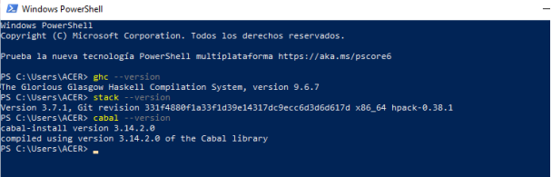

+++
date = '2026-05-10'
draft = false
title = 'Practica 3'
+++

# Universidad Autónoma de Baja California
## Facultad de Ingeniería, Arquitectura y Diseño
### Paradigmas de programación

# PRÁCTICA 3

**Rivera Chavez Josselyn Alexa - 379219**  
**Grupo:** ISYTE 941  
**Profesor:** Jose Carlos Gallegos Mariscal  

Ensenada B.C. a 01 de Mayo de 2026.

---

# INTRODUCCIÓN

En esta práctica se llevó a cabo la instalación del entorno de desarrollo del lenguaje Haskell utilizando la herramienta GHCup, la cual nos permite configurar de manera automática todos los componentes necesarios para programar. También se realizó un primer acercamiento al paradigma de programación funcional mediante el análisis de una aplicación tipo lista de tareas (TODO), desarrollada en Haskell, con el objetivo de comprender su estructura, funcionamiento y diferencias con lenguajes imperativos como C.

# DESARROLLO

Para instalar el entorno de desarrollo, se accedió al sitio oficial de Haskell, donde se recomienda el uso de la herramienta GHCup. Se copió el comando proporcionado y se ejecutó en una terminal de PowerShell sin privilegios de administrador.

Durante la instalación, GHCup descargó automáticamente herramientas como el compilador Glasgow Haskell Compiler, el intérprete Hugs, el servidor de lenguaje Haskell Language Server, así como los gestores de paquetes Stack y Cabal.

Una vez finalizado el proceso, se verificó la instalación ejecutando comandos básicos como `ghc --version` y `stack --version`.

| Componente | Definición |
|---|---|
| GHCup | Herramienta principal para la instalación del entorno de desarrollo. |
| GHC | Compilador de Haskell, responsable de convertir el código fuente (.hs) en un programa ejecutable. |
| Hugs | Intérprete interactivo de Haskell (REPL - Read-Eval-Print Loop). |
| HLS | Haskell Language Server, que proporciona las librerías y herramientas estándar del lenguaje. |
| Stack | Administrador de paquetes, con una funcionalidad análoga a pip en Python. |
| Cabal | Herramienta de construcción (Build tool), que integra la funcionalidad de Stack y GHC en un único comando. |

# ¿Qué es la aplicación TODO?

La aplicación TODO es una lista de tareas interactiva que corre directamente en la terminal. Está escrita en Haskell y se construye usando Stack como manejador de proyecto. El usuario puede agregar, eliminar, editar, mostrar y listar tareas mediante comandos de texto.

# Estructura del proyecto

Cuando se crea un proyecto con Stack usando el comando `stack new todo`, se genera automáticamente esta estructura de archivos:

- `app/Main.hs` → Es el punto de entrada de la aplicación. Muestra el menú con los comandos disponibles e inicia la app con una lista vacía llamando a la función `prompt []`
- `src/Lib.hs` → Contiene toda la lógica de la aplicación: agregar, eliminar, editar, mostrar e invertir tareas
- `test/Spec.hs` → Contiene pruebas unitarias para verificar que las funciones funcionan correctamente
- `package.yaml` → Declara las dependencias externas del proyecto
- `stack.yaml` → Configuración de versiones y snapshot de paquetes

# Cómo funciona por dentro

`Main.hs` simplemente muestra el menú y llama a `prompt []` que es la función principal de `Lib.hs`. El `[]` significa que arranca con una lista vacía.

`Lib.hs` contiene la función `prompt` que funciona así:

- Lee un comando del usuario
- Lo pasa a la función `interpret`
- `interpret` usa pattern matching para decidir qué hacer según el comando
- Al final siempre se llama a sí misma de nuevo con la lista actualizada

Esto es importante porque en Haskell no existen los bucles como en C o Python. En lugar de un `while`, la función se llama a sí misma recursivamente. La lista de tareas no se guarda en una variable global, sino que se pasa como parámetro en cada llamada.

# Comandos disponibles en la app

| Comando | Qué hace |
|---|---|
| `+ <texto>` | Agrega una tarea nueva al inicio de la lista |
| `- <número>` | Elimina la tarea con ese número |
| `s <número>` | Muestra solo esa tarea |
| `e <número>` | Edita esa tarea |
| `l` | Lista todas las tareas con su número |
| `r` | Muestra la lista en orden inverso |
| `c` | Limpia toda la lista |
| `q` | Sale de la aplicación |

# Comandos de Stack para correr la app

| Comando | Qué hace |
|---|---|
| `stack new todo` | Crea el proyecto con la estructura de archivos |
| `stack run` | Compila el proyecto y lo ejecuta |
| `stack test` | Corre las pruebas unitarias |
| `stack repl` | Abre el intérprete para probar funciones individualmente |
| `stack build` | Solo compila sin ejecutar |

# Diferencias con C

- No hay bucles → se usa recursión en su lugar
- No hay variables mutables → el estado se pasa como parámetro
- No hay efectos secundarios implícitos → todo I/O se maneja con el tipo `IO`
- El tipo `Maybe` → en lugar de devolver `-1` o `NULL` cuando algo falla, las funciones devuelven `Nothing` (falló) o `Just valor` (éxito)

# CONCLUSIÓN

En esta práctica se logró instalar el entorno de desarrollo de Haskell, que nos permite trabajar con sus herramientas principales, además, se analizó el funcionamiento de una aplicación de tipo TODO, facilitando la comprensión de conceptos que son fundamentales del paradigma funcional, conceptos como el uso de recursión en lugar de bucles y la inmutabilidad de los datos. También se identificaron algunas diferencias importantes entre Haskell y lenguajes como C, que nos permite ampliar la perspectiva sobre las distintas formas de desarrollar software.