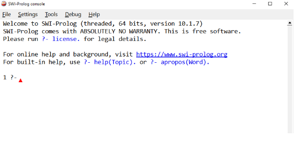
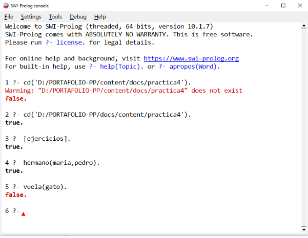
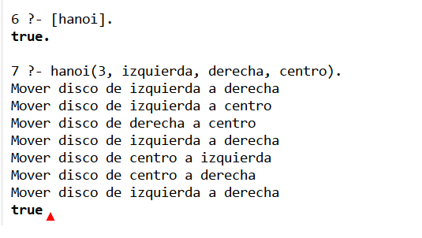
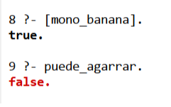
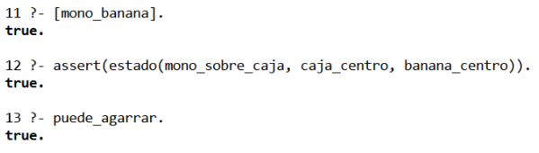

+++
date = '2026-03-12T19:26:02-07:00'
draft = false
title = 'Practica 4'
+++

# Práctica 4 – Paradigma Lógico con Prolog

## Introducción

Prolog es un lenguaje de programación basado en el paradigma lógico. A diferencia de los lenguajes imperativos tradicionales, Prolog trabaja mediante hechos, reglas y consultas lógicas. El programador define conocimiento y relaciones, mientras que el motor de inferencia se encarga de encontrar respuestas.

En esta práctica se realizó la instalación del entorno de desarrollo SWI-Prolog y se desarrollaron distintos ejercicios para comprender el funcionamiento del paradigma lógico. Además, se implementaron aplicaciones clásicas como el problema de las Torres de Hanoi y el problema de la banana y el mono.

---

# Objetivo

Comprender el funcionamiento del paradigma lógico mediante el uso del lenguaje Prolog, desarrollando programas basados en hechos, reglas y consultas, además de resolver problemas clásicos utilizando razonamiento lógico.

---

# Primera sesión

## Instalación del entorno de desarrollo e introducción a Prolog

Durante la primera sesión se instaló SWI-Prolog para poder ejecutar programas escritos en Prolog.

## Evidencia de instalación de SWI-Prolog



## Conceptos básicos de Prolog

En Prolog se utilizan:
- Hechos
- Reglas
- Consultas

## Ejemplo de hechos

```prolog
padre(juan, maria).
padre(juan, pedro).
madre(ana, maria).
madre(ana, pedro).
```

## Ejemplo de regla

```prolog
hermano(X,Y) :-
    padre(P,X),
    padre(P,Y),
    X \= Y.
```

## Ejemplo de consulta

```prolog
?- hermano(maria,pedro).
```

Resultado:

```prolog
true.
```

## Evidencia de consultas en Prolog



---

# Segunda sesión

## Continuación de programación con Prolog

En esta sesión se realizaron ejercicios adicionales para comprender el uso de reglas y consultas.

## Programa de animales

```prolog
animal(perro).
animal(gato).
animal(pajaro).

vuela(pajaro).

mamifero(X) :-
    animal(X),
    X \= pajaro.
```

## Consultas

```prolog
?- mamifero(perro).
```

Resultado:

```prolog
true.
```

```prolog
?- vuela(gato).
```

Resultado:

```prolog
false.
```

## Programa de números

```prolog
par(X) :-
    0 is X mod 2.

impar(X) :-
    1 is X mod 2.
```

## Consultas

```prolog
?- par(8).
```

Resultado:

```prolog
true.
```

```prolog
?- impar(5).
```

Resultado:

```prolog
true.
```

---

# Tercera sesión

# Aplicaciones con Prolog

## Problema de las Torres de Hanoi

Las Torres de Hanoi consisten en mover discos desde una torre origen hacia una torre destino utilizando una torre auxiliar.

## Código en Prolog

```prolog
hanoi(1, Origen, Destino, _) :-
    write('Mover disco de '),
    write(Origen),
    write(' a '),
    write(Destino), nl.

hanoi(N, Origen, Destino, Auxiliar) :-
    N > 1,
    M is N - 1,
    hanoi(M, Origen, Auxiliar, Destino),
    hanoi(1, Origen, Destino, Auxiliar),
    hanoi(M, Auxiliar, Destino, Origen).
```

## Ejecución

```prolog
?- hanoi(3, izquierda, derecha, centro).
```

## Evidencia Torres de Hanoi



---

## Problema de la banana y el mono

Este problema consiste en ayudar a un mono a alcanzar una banana utilizando una caja.

## Código en Prolog

```prolog
:- dynamic estado/3.

estado(mono_piso, caja_esquina, banana_centro).

puede_agarrar :-
    estado(mono_sobre_caja, caja_centro, banana_centro).

mover(mono, piso, caja, centro).
mover(caja, esquina, centro).
subir(mono, caja).
```

## Consulta inicial

```prolog
?- puede_agarrar.
```

Resultado:

```prolog
false.
```

## Cambio de estado

```prolog
?- assert(estado(mono_sobre_caja, caja_centro, banana_centro)).
```

## Consulta final

```prolog
?- puede_agarrar.
```

Resultado:

```prolog
true.
```

## Evidencia Banana y Mono





---

# Explicación de los programas

## Torres de Hanoi

El programa utiliza recursividad para resolver el problema. Primero mueve los discos superiores hacia la torre auxiliar, después mueve el disco principal a la torre destino y finalmente mueve nuevamente los discos desde la torre auxiliar hasta la torre destino.

## Banana y el mono

El programa representa estados y acciones mediante hechos y reglas. El mono solamente puede alcanzar la banana cuando se encuentra sobre la caja y la caja está ubicada debajo de la banana.

---

# Resultados obtenidos

Durante la práctica fue posible comprender el funcionamiento básico de Prolog y la forma en que trabaja el paradigma lógico.

Se realizaron consultas utilizando hechos y reglas, observando cómo el sistema responde con verdadero o falso dependiendo de las relaciones definidas.

También se logró implementar aplicaciones clásicas utilizando razonamiento lógico y recursividad.

---

# Conclusión

La práctica permitió conocer el paradigma lógico y el funcionamiento de Prolog mediante el uso de hechos, reglas y consultas. Además, se observó cómo problemas clásicos pueden resolverse mediante razonamiento lógico y recursividad.

El uso de Prolog resulta útil para representar conocimiento y resolver problemas relacionados con inteligencia artificial, sistemas expertos y búsqueda lógica.

---

### Enlaces de Entrega
Josselyn Alexa Rivera Chavez
* Repositorio: https://github.com/JosselynAlexa/portafolio-PP
* Página Publicada: https://josselynalexa.github.io/portafolio-PP/practica4/